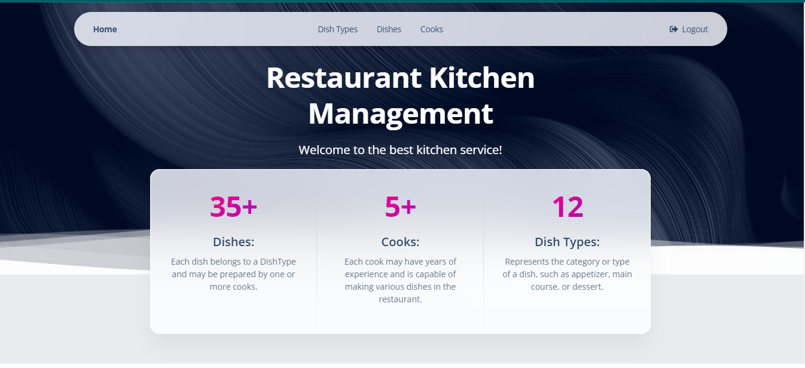

# Dish tracker

Dish Tracker is a restaurant management system designed to improve communication and organization in the kitchen.

## Installing

Python3 must be already installed

```shell
git clone https://github.com/oboliziuk/dish_tracker
cd dish_tracker
python3 -m venv venv
source venv/bin/activate
pip install -r requirements.txt
python manage.py runserver # starts Django Server
```

### Building

For the Dish Tracker project, here are the steps to take after making code changes:

Apply Database Migrations: If your changes affect the database (like model changes), apply the migrations:

```shell
python manage.py makemigrations
python manage.py migrate
```

Run Tests: After changes, run the tests to ensure everything works as expected:
```shell
python manage.py test
```

## Features

Here are the main features that the Dish Tracker project offers:

Cooks Management: Create, update, and delete records for cooks, and assign them to specific dishes.
* Dish & DishType Management: Add new dishes and dish types, categorize dishes, and assign cooks responsible for each dish's preparation.
* Tracking: Track the number of visits to the application using session-based counters.
* Search Functionality: Easily search through the list of dishes, dish types, and cooks to quickly find the desired records.
* Secure Authentication: Login/logout system with password reset and change options to ensure only authorized users can manage the restaurant's data.

## Demo

